# Introduction to Naming Schemes, Networks, Clients, and Services with Java

**Author:** Daniel Esteban Rodriguez Suarez    

---

## General Description

This workshop covers the fundamentals of network programming in Java using the `java.net` package. Through seven hands-on exercises, the core concepts of TCP and UDP communication are explored, including working with URLs, sockets, datagrams, and Remote Method Invocation (RMI). Each exercise builds on the previous ones, progressing from basic URL handling to distributed object communication via RMI.

**Topics covered:**
- URL creation and parsing
- Reading content from the internet using streams
- TCP client-server communication with sockets
- UDP communication with datagrams
- HTTP server implementation
- Remote Method Invocation (RMI)

---

## Project Structure

```
src/main/java/
├── ejercicio1/   → URL methods
├── ejercicio2/   → URL browser
├── ejercicio3/   → Socket square server
├── ejercicio4/   → Socket trig server
├── ejercicio5/   → HTTP server
├── ejercicio6/   → UDP datagrams clock
└── ejercicio7/   → RMI chat
```

---

## Exercise 1 — URL Methods

### Description
A program that creates a URL object and prints the values returned by its 8 methods: `getProtocol`, `getAuthority`, `getHost`, `getPort`, `getPath`, `getQuery`, `getFile`, and `getRef`.

### Explanation
The `URL` class in Java's `java.net` package provides methods to decompose a URL into its individual components. A URL object is created from a string, and each method extracts a specific part: the protocol (e.g., `http`), the host (e.g., `www.example.com`), the port number, the file path, and optional query parameters or fragment references.

### Observations
- If a component is not present in the URL (e.g., no query string), the method returns `null` or `-1` for the port.
- The `getFile()` method returns the path plus the query string combined.
- The `getAuthority()` method returns host and port together.

### Test Screenshot


---

## Exercise 2 — URL Browser

### Description
A console application that asks the user for a URL, reads its content using streams, and saves the result to a file named `resultado.html`.

### Explanation
The program uses the `URL` class to open a stream to the given address via `openStream()`. The content is read line by line using a `BufferedReader` and written to a local file using a `PrintWriter`. This simulates the basic behavior of a web browser downloading a page.

### Observations
- The resulting `resultado.html` file can be opened in any browser to visualize the downloaded page.
- Some HTTPS sites may require additional SSL configuration; HTTP URLs work without extra setup.
- The file is saved in the root directory of the project (where Maven is executed from).

### Test Screenshot

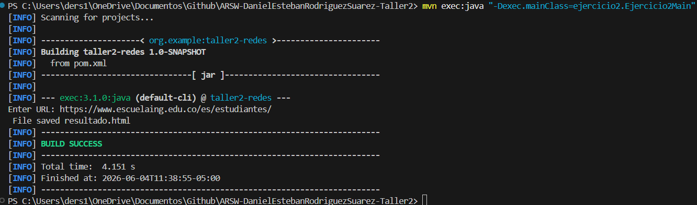

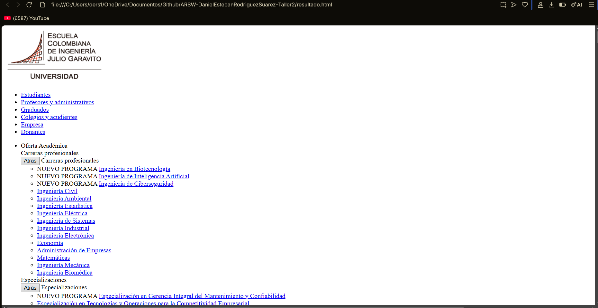

---

## Exercise 3 — Socket Square Server

### Description
A TCP server that receives a number from a client and responds with the square of that number.

### Explanation
The server uses `ServerSocket` to listen on port 35000. When a client connects, it reads a number sent as a string, parses it as a `double`, computes its square, and sends the result back. The client connects using a `Socket`, sends a number via `PrintWriter`, and reads the response with a `BufferedReader`.

### Observations
- The server handles one client at a time sequentially.
- If the client sends a non-numeric value, the server responds with an error message instead of crashing.
- The server and client must be run in separate terminals.

### Test Screenshot

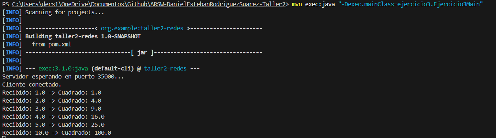

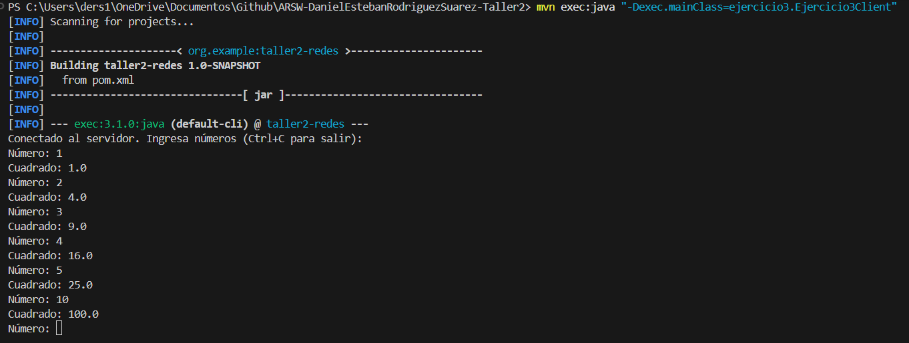

---

## Exercise 4 — Socket Trigonometry Server

### Description
A TCP server that receives a number and computes a trigonometric function (sin, cos, or tan) on it. The active function can be changed by sending a message starting with `fun:` (e.g., `fun:sin`). The default function is cosine.

### Explanation
The server maintains a state variable (`funcion`) that tracks the current trigonometric function. When a message starting with `fun:` is received, the server updates this variable. Otherwise, it parses the input as a number and applies the current function using `Math.sin()`, `Math.cos()`, or `Math.tan()`. This demonstrates stateful server-side logic over a persistent TCP connection.

### Observations
- The server defaults to cosine (`cos`) at startup.
- Sending `fun:sin`, `fun:cos`, or `fun:tan` switches the active function for all subsequent calculations.
- Input angles are expected in radians (e.g., π/2 ≈ 1.5708).

### Test Screenshot

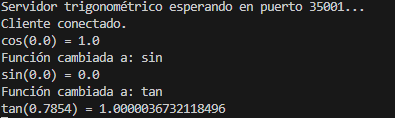

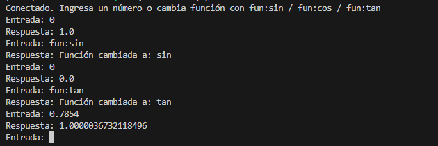

---

## Exercise 5 — Multi-Request HTTP Server

### Description
An HTTP server that handles multiple sequential (non-concurrent) requests, returning HTML files and images to the browser.

### Explanation
The server runs in an infinite loop using `ServerSocket`, accepting one connection at a time. For each request, it parses the HTTP `GET` request line to determine the requested file path, reads the file from the `www/` directory using `Files.readAllBytes()`, and sends it back with the appropriate HTTP headers and `Content-Type`. If the file is not found, a 404 response is returned.

### Observations
- Files must be placed in the `www/` folder at the project root.
- The server correctly identifies content types for `.html`, `.png`, `.jpg`, and other formats.
- The browser automatically requests `favicon.ico`; the server handles missing files gracefully with a 404 response.

### Test Screenshot

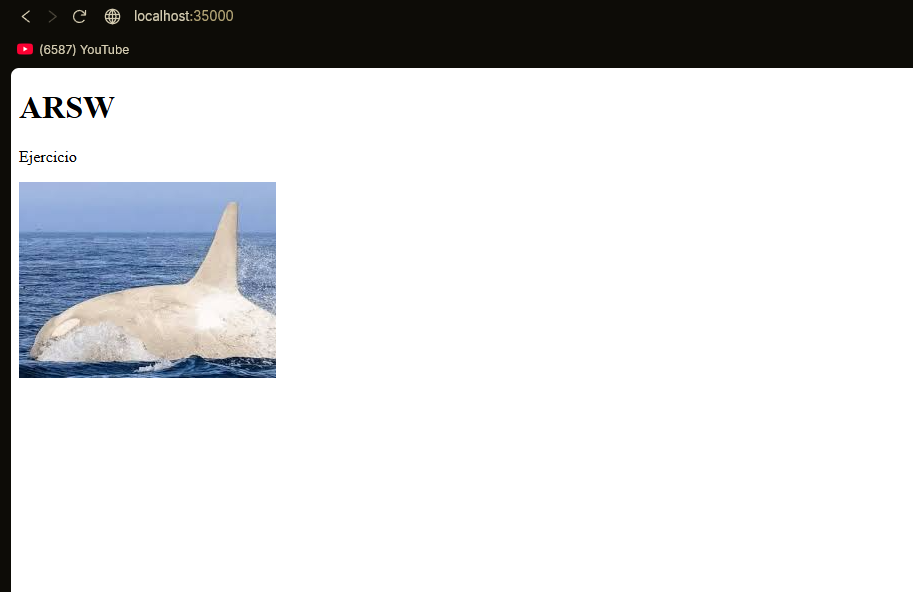

---

## Exercise 6 — UDP Datagram Clock Client

### Description
A UDP client that queries a time server every 5 seconds and displays the current server time. If a response is not received, the last known time is kept. The client continues working even if the server temporarily goes offline.

### Explanation
The server uses `DatagramSocket` bound to port 4445. It waits for any incoming packet and responds with the current date and time as a string. The client sends a request packet every 5 seconds using `Thread.sleep(5000)` and waits for the response with a timeout (`setSoTimeout(3000)`). If no response arrives within the timeout, the client catches the exception and displays the last received time instead of crashing.

### Observations
- UDP does not guarantee delivery, so the client must handle missing responses gracefully.
- The 3-second socket timeout prevents the client from blocking indefinitely.
- When the server is restarted after being offline, the client automatically resumes receiving updates.

### Test Screenshot

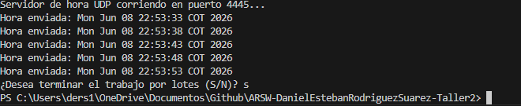

---

## Exercise 7 — RMI Chat Application

### Description
A chat application built with Java RMI. Each instance asks for an IP and port to connect to another instance, and also publishes its own remote object on a specified port so others can connect to it.

### Explanation
The application uses Java RMI to enable remote method invocation between JVMs. A `ChatService` interface defines two remote methods: `sendMessage()` and `receiveMessage()`. The server implements this interface and maintains a separate message queue per client, identified by a unique client ID (UUID). Each client runs a background thread that polls the server every second for new messages, while the main thread reads user input and sends it to all connected clients via the server.

### Observations
- Each client registers itself with a unique ID so the server can maintain independent message queues per client.
- All clients receive all messages broadcast through the server.
- The server must be started before any client attempts to connect.
- RMI requires the registry to be running; in this implementation, `createRegistry()` is called directly from the server.

### Test Screenshot

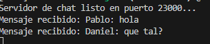

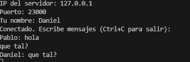

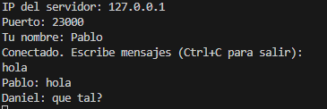

---

## How to Run

### Prerequisites
- Java 17
- Maven 3.8+

### Running each exercise

```bash
# Exercise 1
mvn exec:java "-Dexec.mainClass=ejercicio1.Ejercicio1Main"

# Exercise 2
mvn exec:java "-Dexec.mainClass=ejercicio2.Ejercicio2Main"

# Exercise 3 — open two terminals
mvn exec:java "-Dexec.mainClass=ejercicio3.Ejercicio3Main"   # Terminal 1: server
mvn exec:java "-Dexec.mainClass=ejercicio3.Ejercicio3Client" # Terminal 2: client

# Exercise 4 — open two terminals
mvn exec:java "-Dexec.mainClass=ejercicio4.Ejercicio4Main"   # Terminal 1: server
mvn exec:java "-Dexec.mainClass=ejercicio4.Ejercicio4Client" # Terminal 2: client

# Exercise 5 — open browser at http://localhost:35000
mvn exec:java "-Dexec.mainClass=ejercicio5.Ejercicio5Main"

# Exercise 6 — open two terminals
mvn exec:java "-Dexec.mainClass=ejercicio6.Ejercicio6Server" # Terminal 1: server
mvn exec:java "-Dexec.mainClass=ejercicio6.Ejercicio6Main"   # Terminal 2: client

# Exercise 7 — open three terminals
mvn exec:java "-Dexec.mainClass=ejercicio7.ChatServer"       # Terminal 1: server
mvn exec:java "-Dexec.mainClass=ejercicio7.Ejercicio7Main"   # Terminal 2: client1
mvn exec:java "-Dexec.mainClass=ejercicio7.Ejercicio7Main"   # Terminal 3: client2
```
---

## References

- Oracle Java Networking Tutorial: https://docs.oracle.com/javase/tutorial/networking/index.html
- Java `java.net` package documentation: https://docs.oracle.com/en/java/docs/api/java.base/java/net/package-summary.html
- Java RMI documentation: https://docs.oracle.com/javase/tutorial/rmi/index.html
- Escuela Colombiana de Ingeniería — ARSW 2026-i workshop material

